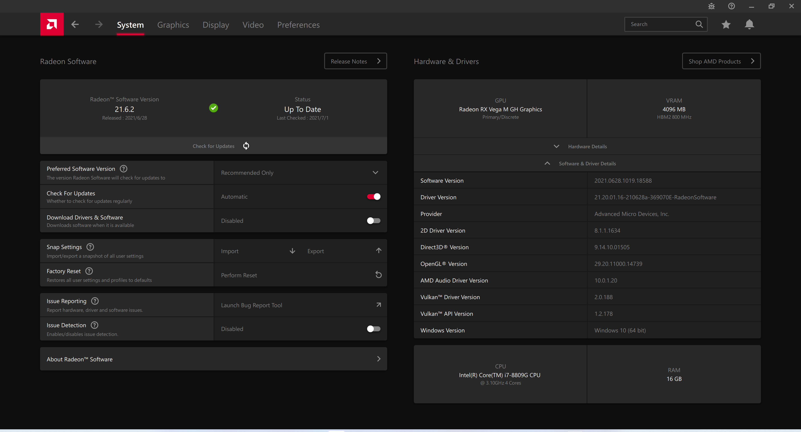
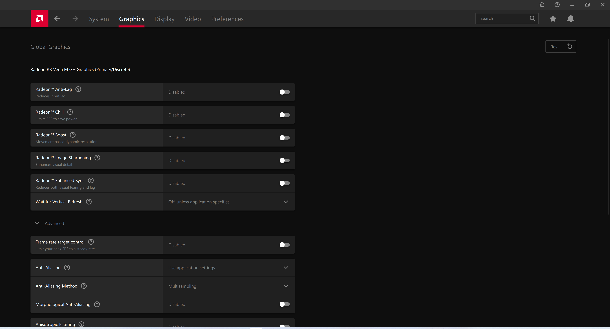
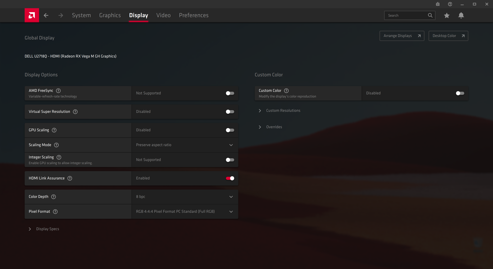
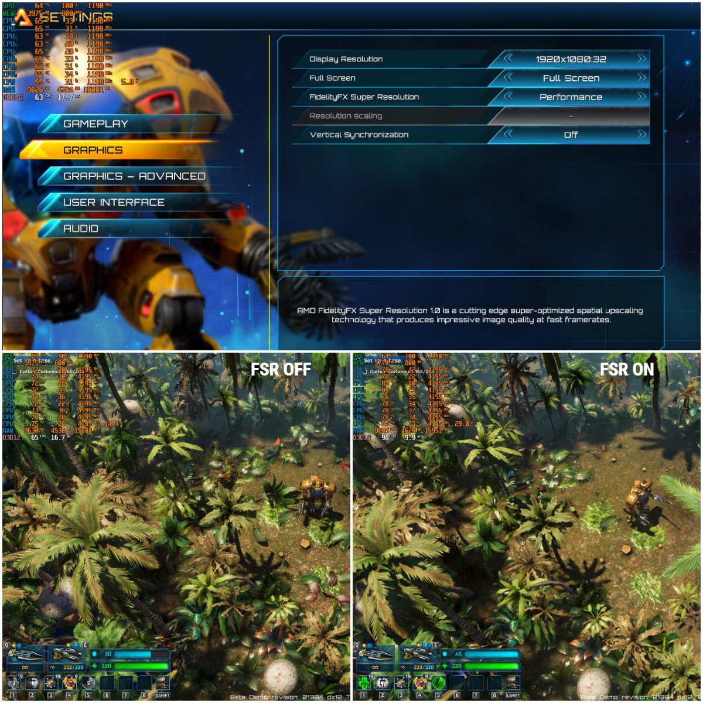

# Hades-VegaM

English | [中文README](./README.zh-CN.md)

## Overview

### Preview

### Support OS

* [x] Windows 10
* [x] Windows 11 Insider Preview

### Install

Just make sure disable driver signature enforcement beforce install or update this.

Simple Guide: [How to Disable Driver Signature Verification on 64-Bit Windows](https://www.howtogeek.com/167723/how-to-disable-driver-signature-verification-on-64-bit-windows-8.1-so-that-you-can-install-unsigned-drivers/)

### Working Hardware

* [x] Intel NUC Hades Canyon (NUC8i7HNK/NUC8i7HVK)
* [x] Dell XPS 15 9575 2-in-1
* [x] Dell Precision 5530 2-in-1
* [x] Acer Aspire 7
* [x] Acer ConceptD 5
* [x] HP Spectre x360 15

### Working Features

* [x] New Games Optimization(Possible)
* [x] AMD Link
* [x] AMD Bug Report Tool
* [x] New Vulkan Extension
* [x] New Radeon Boost Support Games
* [x] New Radeon Software Options
* [x] AMD Crash Defender
* [x] AMD FidelityFX Super Resolution (FSR)
* [x] Bug Fixing

### Not Working/Issues

Please report and track [issues here](https://github.com/leogcry22/Hades-VegaM/issues).
