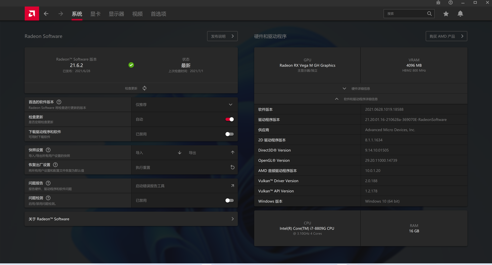
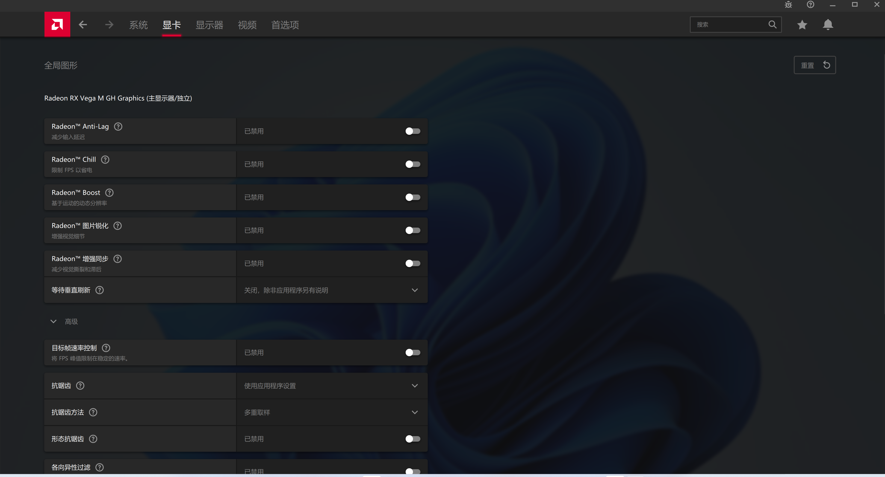
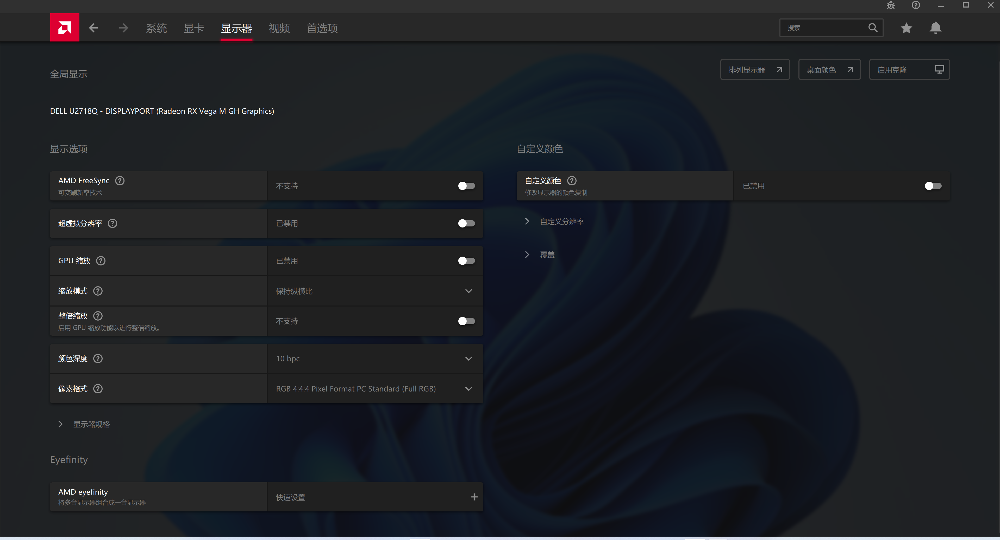

# Hades-VegaM

    

中文README | [English](./README.md)

## 介绍

魔改新版AMD驱动使其重新支持被放弃的Kaby Lake G系列SoC内置的GPU（Radeon™ RX Vega M GL/Radeon™ RX Vega M GH），如英特尔的NUC冥王峡谷及其它品牌同SoC的一系列产品等，持续更新中。

### 预览

### 支持的操作系统

* [x] Windows 10
* [x] Windows 11 体验预览版

### 安装

运行之前请确保已经成功禁用系统驱动程序强制签名，之后即可像正常一样进行安装或升级，详细可直接参考我的[知乎安装指南](https://zhuanlan.zhihu.com/p/333841073)。

### 支持的硬件（i5-8305G / i7-8705G / i7-8706G / i7-8709G / i7-8809G）

* [x] 英特尔NUC冥王峡谷（NUC8i7HNK/NUC8i7HVK）
* [x] 戴尔XPS 15 9575 2-in-1
* [x] 戴尔Precision 5530 2-in-1
* [x] 宏碁Aspire 7
* [x] 宏碁ConceptD 5
* [x] 惠普Spectre x360 15

### 支持的功能

* [x] 新游戏优化（可能，不太确定）
* [x] AMD Link
* [x] AMD Bug Report Tool
* [x] 新的Vulkan扩展
* [x] Radeon Boost新游戏支持
* [x] 新的Radeon Software功能选项
* [x] AMD Crash Defender
* [x] AMD FidelityFX超采样（FSR）
* [x] Bug修复

### 不工作/Bug

若有任何问题，请提交至 [issues](https://github.com/leogcry22/Hades-VegaM/issues)。
